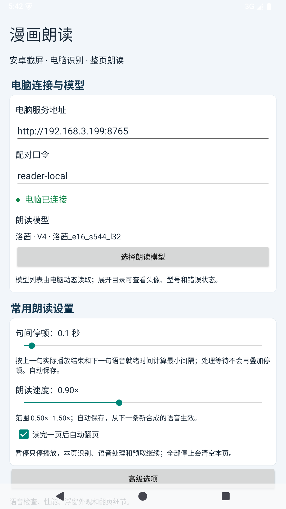
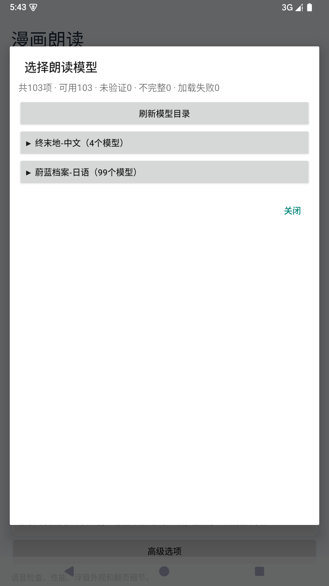
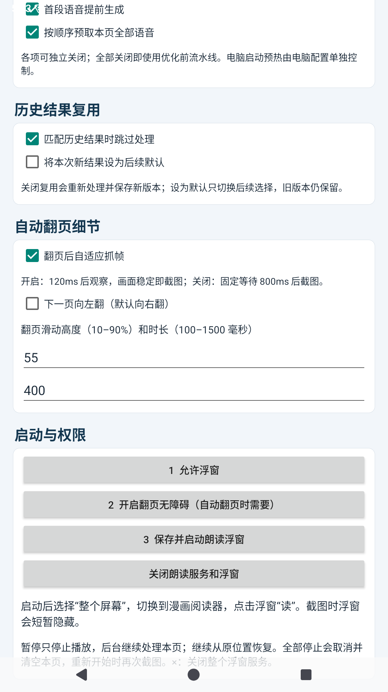

# 漫画朗读

在 Android 上打开漫画，点击浮窗，电脑会按阅读顺序识别并朗读文字，也可以在读完后自动翻页。所有处理都在本机完成，使用时电脑需保持开机。

## 效果预览

<p align="center">
  
</p>

<audio controls preload="metadata" src="https://raw.githubusercontent.com/adadsws/manga-reader/main/docs/readme-assets/reading-preview.wav">
  当前页面不支持直接播放音频。
</audio>

▶ [下载试听音频](docs/readme-assets/reading-preview.wav)

| 连接与设置 | 选择角色 |
|---|---|
|  |  |
| 自动翻页设置 | 朗读浮窗 |
|  |  |

## 第一次准备

需要 Windows 电脑和 NVIDIA 显卡。先按当前电脑修改 `config/runtime.json`、`config/reader.json` 和 `config/tts.yaml` 中的路径，再在项目目录依次运行：

```powershell
python tools/download_blue_archive_hina.py
powershell -NoProfile -ExecutionPolicy Bypass -File tools/prepare_runtime.ps1
python tools/prepare_layout.py
```

第一条命令只下载“蔚蓝档案·日奈”一个角色，已有日奈模型时可以跳过；第二、三条命令准备运行环境和漫画分析模型。

模型来源及重新下载方法见[日奈模型说明](models/gpt-sovits/蔚蓝档案-日语.md)和[Magi 模型说明](models/layout/magiv2.md)。

## 路线一：安卓模拟器

项目使用 Google 官方 Android Emulator，不使用第三方模拟器。

首次使用时，在项目目录运行：

```powershell
python tools/prepare_android.py
python tools/prepare_avd.py
python tools/build_android.py
```

以后双击 [启动电脑服务和安卓模拟器.bat](启动电脑服务和安卓模拟器.bat)，等待应用显示“电脑已连接”。漫画图片可以直接拖进模拟器窗口打开。

## 路线二：真实手机

1. 让电脑和手机连接同一个 Wi-Fi，不要使用访客网络。
2. 把 [reader.apk](reader.apk) 发送到手机并安装；以后更新仍安装这个文件。
3. 双击 [仅启动电脑服务.bat](仅启动电脑服务.bat)。
4. 把电脑窗口显示的连接地址和配对口令填入手机应用，等待“电脑已连接”。

真机路线仍在完善；遇到问题时建议先用模拟器确认电脑端能够正常运行。

## 开始朗读

模拟器和真实手机的操作相同：

1. 选择角色并调整朗读设置。
2. 首次使用时点 `1 允许浮窗`，在系统设置中授权后返回应用。
3. 需要自动翻页时，点 `2 开启翻页无障碍`，选择“漫画朗读”并允许完全控制设备；手动翻页可跳过。
4. 点 `3 保存并启动朗读浮窗`，系统询问共享范围时选择“整个屏幕”。
5. 打开漫画，点浮窗上的 `▶ 重新开始`。

浮窗和无障碍权限通常只需授权一次；“整个屏幕”需要在启动朗读时确认。

## 常见问题

- 手机连不上：检查 Wi-Fi、连接地址和配对口令，并关闭访客网络或设备隔离。
- 读错或漏读：放大漫画后重新开始；复杂字体、极小文字和特殊分镜仍可能识别错误。
- 语音失败：点浮窗中的“查看完整错误”，同时检查电脑窗口中的提示。
- 停止电脑服务：在项目目录运行 `仅启动电脑服务.bat stop`。

版本变化见[更新记录](CHANGELOG.md)。
